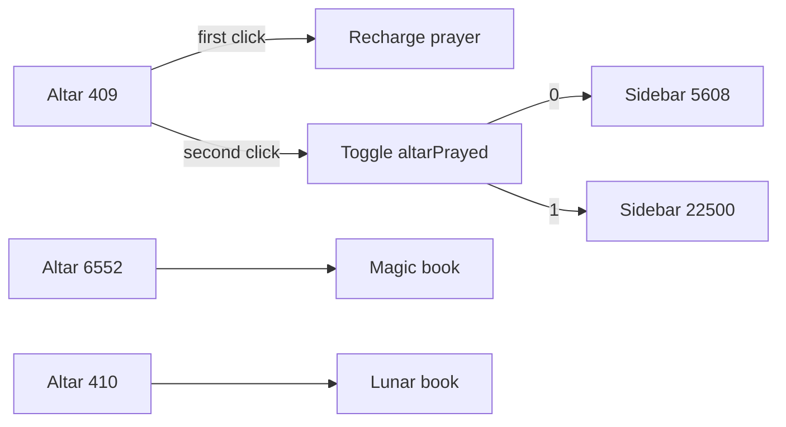

# Soul-Trail curses, items, and objects

One sequenced project in this order: **curses + Edgeville altar**, then **Deathly item combat**, then **object interactions**. Source of truth for stats/specs is the Deathly server. JDK 8 compile stays `-source 1.7 -target 1.7` (no lambdas/diamond). Do not steal F11, do not undo RuneLite-style plugins, do not commit unless asked.

Soul-Trail already has Edgeville magic altars (`6552` ancients at 3094,3506; `410` lunars at 3101,3504) and a prayer-recharge altar (`409` at 3091,3506). Prayer tab `5608` (through Piety) already exists. Curses tab `22500`, book-swap, and most curse combat effects do not.

## Phase 1 — Curses prayer book + Edgeville swap

**Client UI**

- Copy `CurseTab/` sprites into the live cache (`C:\Users\llrbi\Soul-Trail\Sprites\`, path used by `[Sprite.java](Biohazard V3 package/Biohazard v3 server client cache/Proxy Client/src/Sprite.java)` `signlink.findcachedir() + "/Sprites/"`). Source is Deathly’s cache (`C:\Users\llrbi\Desktop\Deathly Client\Cache\Sprites\CurseTab` or equivalent). Files: `GLOW 0/1`, `PRAYON n`, `PRAYOFF n`, `ICON 0`.
- Port Deathly `Curses()` and the 7-arg `addPrayer(...)` (parent `22500`, configs 610–629) from `[Deathly Client RSInterface.java](C:\Users\llrbi\Desktop\Deathly Client\src\RSInterface.java)` into Soul-Trail. Keep the existing 6-arg `addPrayer` used by `[Interfaces.prayerTab](Biohazard V3 package/Biohazard v3 server client cache/Proxy Client/src/Interfaces.java)` (5608 / Piety) unchanged.
- Call `Curses(textDrawingAreas)` from `Interfaces.loadInterfaces` after `prayerTab`. Helpers `drawTooltip` / `setChildren` / `setBounds` already exist.

**Server curses**

- Port `[Curse.java](C:\Users\llrbi\Desktop\Deathly Source\src\server\model\players\Curse.java)` into `server.game.players.combat.Curse` (Soul-Trail packages). Wire `Client.getCurse()`.
- On `[Player](Biohazard V3 package/Biohazard v3 server client cache/Proxy Server/src/server/game/players/Player.java)`: add `altarPrayed`, `CURSE_LEVEL_REQUIRED`, `CURSE_GLOW` (610–629), `CURSE_HEAD_ICONS`, `CURSE_NAME`. `curseActive[20]` already exists.
- `[PlayerSave](Biohazard V3 package/Biohazard v3 server client cache/Proxy Server/src/server/game/players/PlayerSave.java)`: persist `altarPrayed`.
- `[ClickingButtons](Biohazard V3 package/Biohazard v3 server client cache/Proxy Server/src/server/game/players/packets/ClickingButtons.java)`: port Deathly curse cases `87231`–`88013` → `getCurse().activateCurse(0..19)`. Ignore those buttons when `altarPrayed == 0`; ignore regular prayer buttons when `altarPrayed == 1`.
- `[PlayerAssistant.setSidebarInterfaces](Biohazard V3 package/Biohazard v3 server client cache/Proxy Server/src/server/game/players/PlayerAssistant.java)`: sidebar 5 = `22500` if `altarPrayed == 1`, else `5608`. Same on login.

**Edgeville altar (keep magic altars)**

- `[ActionHandler](Biohazard V3 package/Biohazard v3 server client cache/Proxy Server/src/server/game/players/ActionHandler.java)` case `409` stays **first-click recharge**.
- **Second-click `409`**: toggle `altarPrayed`, `setSidebarInterface(5, 5608|22500)`, gfx, reset the book you left (`resetPrayers` vs `resetCurse`). Message that the altar switches prayer books.
- Do **not** reuse `6552` (ancients) or `410` (lunars). No extra spawn needed — `409` is already spawned at 3091,3506 in `[ObjectManager.loadCustomSpawns](Biohazard V3 package/Biohazard v3 server client cache/Proxy Server/src/server/world/ObjectManager.java)`.

**Combat hooks** (Deathly `[CombatAssistant](C:\Users\llrbi\Desktop\Deathly Source\src\server\model\players\CombatAssistant.java)`, adapted)

- Drain: extend `handlePrayerDrain` with Deathly `curseData[]`.
- Protect-style: `curseActive[7/8/9]` already stubbed in a couple of spots; apply the rest like Protect Magic/Range/Melee (half damage + head icons).
- Soul Split `[18]`, Turmoil `[19]` max-hit/accuracy, deflect on hit, leech/sap procs.
- Do **not** turn `EventManager.initialize()` back on. Use existing `[CycleEventHandler](Biohazard V3 package/Biohazard v3 server client cache/Proxy Server/src/server/game/players/Client.java)` / `Client.process` ticks for delayed claw/leech gfx.

## Phase 2 — Item stats, specs, special bonuses

**Bonuses**

- Merge Deathly `[item.cfg](C:\Users\llrbi\Desktop\Deathly Source\Data\cfg\item.cfg)` into Soul-Trail `[Data/cfg/item.cfg](Biohazard V3 package/Biohazard v3 server client cache/Proxy Server/Data/cfg/item.cfg)` with a one-off script:
  - Match by item id.
  - Copy the 12 bonus columns from Deathly (source of truth).
  - Keep Soul-Trail names/shop/alch unless the id is missing entirely — then append the Deathly row.
- Raise `[Config.ITEM_LIMIT](Biohazard V3 package/Biohazard v3 server client cache/Proxy Server/src/server/Config.java)` (currently 19112) if the merged list exceeds it.

**Specs and equipment**

- Port missing `activateSpecial` cases from Deathly into Soul-Trail `[CombatAssistant.activateSpecial](Biohazard V3 package/Biohazard v3 server client cache/Proxy Server/src/server/game/players/combat/CombatAssistant.java)`. Soul-Trail already has DDS/whip/AGS/godswords/dlong/hally/gmaul/dbaxe. Highest-value missing Deathly weapons: **claws 14484**, **Korasi 19780**, **Statius warhammer 13902**, **Morrigan thrown 13879/13883**, coloured whips, etc.
- Claw 4-hit: `CycleEvent` / `clawDelay` on process, not Deathly `EventManager`.
- `[ItemAssistant.addSpecialBar](Biohazard V3 package/Biohazard v3 server client cache/Proxy Server/src/server/game/items/ItemAssistant.java)` + `[ClickingButtons](Biohazard V3 package/Biohazard v3 server client cache/Proxy Server/src/server/game/players/packets/ClickingButtons.java)` spec-bar cases so new weapons show and toggle the bar.
- Equipment: `is2handed`, `getPlayerAnimIndex`, `getWepAnim`, `getRequirements` for those IDs so they wear, animate, and check levels. Copy from Deathly `ItemAssistant` / `Item.java` only for IDs we actually spec.

## Phase 3 — Object interactions (action-driven, not every scenery id)

Packed Deathly loc already has names/actions on the server (`server.clip.region.ObjectDef`). Most clicks currently fall through to `ScriptManager.callFunc` and do nothing. Generic ladder code in `ActionHandler` is **commented out**.

- Keep existing `firstClickObject` / `secondClickObject` / `thirdClickObject` cases first.
- After the switch `default`, dispatch by **loc action / name** (ignore decorative `null` / hidden-action type-22):
  - Bank / Bank booth / Bank chest → `openUpBank`
  - Climb-up / Climb-down / Climb → height ±1 or ±6400 (restore the commented ladder logic)
  - Open / Close → existing door helpers where present
  - Mine / Prospect, Chop down, Pray-at / Recharge → existing Mining / Woodcutting / 409 recharge
- Edgeville is the first test area (banks, stairs, doors, the three altars).
- Port additional Deathly `ActionHandler` object cases only when they are real unique content (not duplicates of the generic dispatcher).

This will not make every decorative object clickable, and should not: that is what blocked Edgeville walking before.

## Out of scope

- Shops, NPC dialogues, new minigames, summoning.
- Re-enabling `EventManager.initialize()`.
- Changing plugin sidebar / overlays except if curse tab sprites need a client restart.

## Verify

- Compile client + server (`Compile.bat` / master compile; kill Soul-Trail JFrame first if `.class` lock).
- In Edgeville: walk, first-click `409` recharge, second-click swap to curses tab, activate Soul Split / Turmoil (70+ Def), swap back to 5608; `6552`/`410` still swap magic books.
- Wear a Deathly-bonus item (e.g. claws) and confirm equipment screen bonuses + spec bar fire.
- Click Edgeville bank / a ladder / a closed door; confirm decorative floor overlays still do not eat walk clicks.

