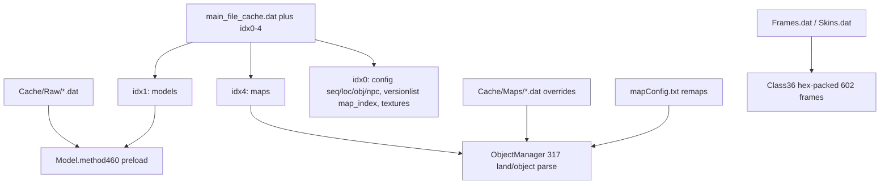

# Transfer Deathly world graphics into Soul-Trail

## What Deathly actually is

Deathly is **not** a different protocol. It is a **317 client engine** (`signlink.clientversion = 317`) packed with **474/508/602-era data**.

`Cache/Maps` and `Cache/Raw` are **not** the whole revision. They are extras on top of a classic Jagex store:

Important folders/files in [C:\Users\llrbi\Desktop\Deathly Client\Cache](C:\Users\llrbi\Desktop\Deathly Client\Cache):

- `main_file_cache.dat` + `idx0`–`idx4` — real cache (models, maps, defs, textures)
- `Raw/` — ~1919 unpacked models, preloaded at startup
- `Maps/` — mostly `.gz` dumps plus some `.dat` **overrides**
- `mapConfig.txt` — ~467 region remaps (`position=region(land)[obj]`)
- `Frames.dat` / `Skins.dat` — packed gzip animation frames (idx2 is unused)
- `3353.dat` / `3403.dat` / `3502.dat` — special anim files
- `Sprites/` and `Lunar/` — **HUD**. We will **not** copy these (your choice: keep Soul-Trail UI)

Deathly comments: `"602 Animation Amount"`, `"508 Object Amount"`, `"602 NPC Amount"`. Frame IDs are **hex-packed** (`file << 16 | frame`), not stock 317 packing.

`Cache/Animations/` is leftover and **not referenced** by current Java. `474ObjectModels.dat` is also dead.

## What Soul-Trail does today

Live cache is [%USERPROFILE%\Soul-Trail](C:\Users\llrbi\Documents\GitHub\rsPROJECTps\Biohazard V3 package\Biohazard v3 server client cache\Proxy Client\src\sign\signlink.java) (falls back to `Biohazard.474`). Classic `main_file_cache.dat` + idx0–4. Sprites are **PNG files beside the cache**, not inside idx.

Relevant gaps vs Deathly:

- [`preloadModels()`](Biohazard V3 package/Biohazard v3 server client cache/Proxy Client/src/client.java) exists but is **commented out**, and reads `./Raw/` instead of the cache dir
- [`Class36`](Biohazard V3 package/Biohazard v3 server client cache/Proxy Client/src/Class36.java) still loads frames from **ondemand idx2**; it has empty `getData()` stubs but **no** `loadFrames`/`loadSkins`
- [`OnDemandFetcher.start`](Biohazard V3 package/Biohazard v3 server client cache/Proxy Client/src/OnDemandFetcher.java) parses `map_index` as **6 bytes/entry**; Deathly uses **7** (extra members byte)
- Map file IDs **> 3535** are forced to `-1` in both clients
- [`ObjectDef.unpackConfig`](Biohazard V3 package/Biohazard v3 server client cache/Proxy Client/src/ObjectDef.java) expects `525loc.dat` — Deathly config will not have that
- No `JavaUncompress.java` (Deathly needs it for Frames/Skins)

Server clipping: [`Region.load()`](Biohazard V3 package/Biohazard v3 server client cache/Proxy Server/src/server/clip/region/Region.java) reads `Data/world/map_index` (6-byte) + `Data/world/map/{id}.gz`. Deathly’s server does **not** ship those files; Deathly’s `Maps/*.gz` dump is what we use.

## Decisions (from you)

- Keep Soul-Trail HUD, plugins, and `Sprites/`
- Transfer world graphics (maps, models, animations, item/NPC/object **looks**)
- Copy maps into Soul-Trail **server clipping** so walking matches
- Keep Soul-Trail **item.cfg / npc.cfg / spawns / gameplay**

That last point means: a Deathly Torva model will only appear if Soul-Trail already has that item ID, or we later add it. This pass is visual + walkable maps, not a Deathly PK economy merge.

## Implementation

### 1. Backup, then copy cache payload (not HUD)

Backup the live cache folder (`Soul-Trail` or `Biohazard.474`) before touching it.

Into the live cache dir, copy from Deathly `Cache\`:

- `main_file_cache.dat`, `main_file_cache.idx0`–`idx4`
- `Raw\`
- `Maps\` (`.dat` overrides **and** `.gz` dumps)
- `mapConfig.txt`
- `Frames.dat`, `Skins.dat`, `3353.dat`, `3403.dat`, `3502.dat`

Do **not** overwrite `Sprites\`, `client_settings.properties`, or plugin data.

### 2. Teach the Soul-Trail client Deathly’s loaders (surgical, not a client swap)

Keep Soul-Trail [`client.java`](Biohazard V3 package/Biohazard v3 server client cache/Proxy Client/src/client.java) / plugins / [`RSInterface`](Biohazard V3 package/Biohazard v3 server client cache/Proxy Client/src/RSInterface.java). Port only the data plumbing:

- Copy [`JavaUncompress.java`](C:\Users\llrbi\Desktop\Deathly Client\src\JavaUncompress.java)
- Port [`Class36.loadFrames` / `loadSkins` / `load_647` / `method531`](C:\Users\llrbi\Desktop\Deathly Client\src\Class36.java) so 602 hex frame IDs resolve from `Frames.dat` instead of idx2
- Call `Class36.loadSkins()` + `loadFrames()` from `startUp` after `Model.method459` (as Deathly does)
- Enable `preloadModels()` but change the path to `signlink.findcachedir() + "Raw/"`
- Port `setNewMaps()` + Deathly `method22()` map-file overrides
- Parse `map_index` as **7 bytes** when length is divisible by 7 (Deathly), keep 6-byte fallback
- Raise/remove the **3535** map-id cap
- Ensure model slot array is large enough for Raw IDs (~65k). Deathly uses `Class21[80000]`

### 3. Config unpackers must match Deathly’s archive

Replacing `main_file_cache` also replaces `seq.dat` / `loc.dat` / `obj.dat` / `npc.dat` / `flo.dat` / `spotanim.dat`. Stock Soul-Trail readers will crash or mis-parse.

Port Deathly unpack/`readValues` for:

- [`Animation.java`](C:\Users\llrbi\Desktop\Deathly Client\src\Animation.java) (602 seq)
- [`ObjectDef.java`](C:\Users\llrbi\Desktop\Deathly Client\src\ObjectDef.java) (508 loc; drop Soul-Trail’s `525loc` requirement)
- [`EntityDef.java`](C:\Users\llrbi\Desktop\Deathly Client\src\EntityDef.java)
- [`ItemDef.java`](C:\Users\llrbi\Desktop\Deathly Client\src\ItemDef.java) base unpack
- `SpotAnim`, `Flo`, `IdentityKit` if their streams differ

Then **re-apply** Soul-Trail [`ItemDef_2.java`](Biohazard V3 package/Biohazard v3 server client cache/Proxy Client/src/ItemDef_2.java) / object-name patches **after** unpack, so custom Soul-Trail items still win on their IDs.

Do **not** replace Soul-Trail `Interfaces.java`, plugin classes, or PNG gameframe.

### 4. Server clipping from Deathly `Maps/*.gz`

1. Copy Deathly `Cache\Maps\*.gz` → [`Proxy Server/Data/world/map/`](Biohazard V3 package/Biohazard v3 server client cache/Proxy Server/Data/world/map)
2. Build a **6-byte** `Data/world/map_index` from Deathly’s versionlist `map_index`, then apply `mapConfig.txt` remaps so server file IDs match what the client actually draws
3. If object collision looks wrong, swap server [`Data/world/object/loc.dat`](Biohazard V3 package/Biohazard v3 server client cache/Proxy Server/Data/world/object) for Deathly loc (clip flags only). Leave Soul-Trail `item.cfg` / `npc.cfg` / spawns alone

Deathly Source has **no** usable `Data/world` maps (`worldmap.bin` missing, `lolmap.bin` unused). The client `Maps/*.gz` dump is the source of truth.

### 5. Compile and smoke-test

- Client `Compile.bat nopause` (Java 7: no lambdas / diamond)
- Login, walk a vanilla area and a `mapConfig` remapped region
- Confirm player/NPC animations, worn items, scenery
- Confirm you cannot walk through Deathly walls (server clip matched)
- Confirm plugin HUD (sidebar, status bars, XP tracker) still draws from Soul-Trail sprites

## Out of scope (this pass)

- Deathly `item.cfg` / `npc.cfg` / `spawn-config.cfg` / object click handlers
- Deathly gameframe / `Cache/Sprites`
- Replacing Soul-Trail plugins or `Interfaces.java`
- Extract-only of `Maps`+`Raw` without `main_file_cache` (that would miss defs, textures, map_index, and most models)

## Main risks

- Interface archive inside idx0 changes with the full `.dat` copy; Soul-Trail `Interfaces.java` rebuilds most tabs, but leftover stock widgets may look different
- Soul-Trail custom item IDs that collide with Deathly HD IDs will show Deathly models unless `ItemDef_2` overrides them
- First boot will be slower (`Raw/` preload + `Frames.dat`)
