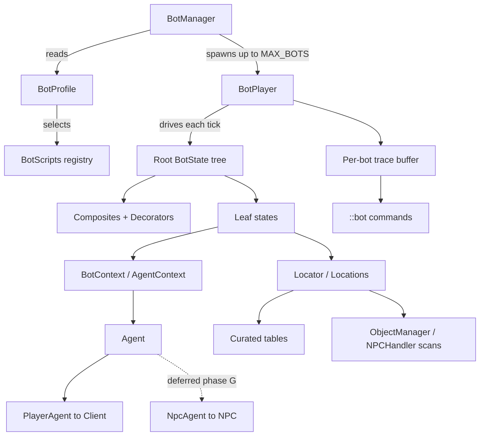

# BOT_ROADMAP.md — making bots scalable and easy to author

Status: **planning doc.** Companion to `BOT_PLAN.md`, which remains the slice-1
specification and is unchanged by this file.

Purpose: describe how the slice-1 bot grows into a system that supports *many* bots and
makes *custom* bots cheap to write — without rewriting the slice-1 core.

Decisions recorded here:

- This is a separate roadmap, not a rewrite of `BOT_PLAN.md`.
- The player/NPC `Agent` abstraction is deliberately deferred to **Phase G** (player
  bots only until then). See §5.1 and §6.

---

## 1. The three axes

"Scalable and easy to author" is three independent problems. A plan should move them
separately because they cost different amounts and pay off at different times.

| Axis | The question | Slice 1 today |
| --- | --- | --- |
| **Authoring** | How much code to define a new bot? | One `BotState` class + hand-wired composite |
| **Composition** | How richly can behaviors be combined? | Only `Sequence` / `Repeat` |
| **World knowledge** | How does a behavior say *what* without hardcoding *where*? | Raw coordinates |

Slice 1 fixes none of these beyond the minimum on purpose. Every phase below is
**additive**: the `BotState` / `BotStatus` contract from `BOT_PLAN.md` §3 never changes.

---

## 2. Design principles

These are the rules that keep the system scalable; each phase is judged against them.

1. **Small, stable surface.** A behavior sees exactly one context object
   (`BotContext`). Everything else is internal and free to change.
2. **Additive extension.** A new capability is a new leaf, decorator, or locator —
   never an edit to the core loop. If a feature requires changing `BotPlayer` or
   `BotManager` to add, it is designed wrong.
3. **Registries, not switches.** Match the codebase's existing idiom
   (`ObjectHandler`, `NpcActionHandler`, `CommandHandler`): object clicks already
   dispatch through a registry, so bot interaction inherits new skills for free.

```53:64:Proxy Server/src/server/game/players/actions/objects/ObjectHandler.java
	public static boolean dispatch(Client c, int objectType, ObjectClick click, int objectX, int objectY) {
		ObjectAction action = byClick.get(click).get(objectType);
		if (action == null) {
			return false;
		}
		action.handle(c, objectType, objectX, objectY);
		return true;
	}
```

4. **Data over code for the common case.** The server already loads `Data/CFG/*.cfg`;
   bot definitions belong in the same place so a routine bot needs no rebuild.
5. **Determinism by injection.** Follow the `PlayerSaving.process(long now)` precedent
   — pass the clock/tick source in so bots are unit-testable without wall-clock flake.
6. **Game thread only, one documented boundary.** All bot logic runs inside the tick.
   Any future off-thread planning crosses an explicit queue (mirroring
   `Client.queuedPackets`), never shared state.

---

## 3. Recommended slice-1 seams (cheap now, expensive later)

These four are individually near-free and remove the bulk of later churn. They are
**additive** to `BOT_PLAN.md` and do not change its seven-step structure.

1. **`BotState.name()`** — a label per node. One method; makes the whole tree
   self-describing and diagnostics possible from day one.
2. **`BotContext` as an interface** — so the `Agent` abstraction (§5.1) can slot in at
   Phase G without editing a single state class.
3. **Slice-1 tiles behind a `FixedLocator`** — the tree says `Tree.OAK`, not
   `(3192, 3223)`, so Phase C is a swap of the locator, not a rewrite of the states.
4. **`BotManager` keyed by a `BotProfile`** (name, spawn, script, loadout) rather than
   loose constructor args — so Phase E is a parser, not a refactor.

If these are adopted in slice 1, phases B–F are almost entirely new files.

---

## 4. Target architecture



The important structural property: **a behavior tree only touches `BotContext`**;
`BotContext` touches an `Agent` and a `Locator`. Those two interfaces are the only
things that know whether the actor is a player or an NPC, and whether a location is
curated or scanned.

---

## 5. The abstractions

### 5.1 `Agent` — separate "an agent" from "a player" (Phase G, deferred)

Today `BotContext` wraps a `BotPlayer`. Later it should wrap an `Agent` so the same
behavior library drives a player bot *and* an NPC — and `WorldAdventurer` is already a
hand-rolled version of exactly this (its own `Phase` enum, `stuckTicks`, and a travel /
work machine).

```java
public interface Agent {
    int x(); int y(); int height();
    void walkTo(int x, int y);
    void interactObject(int objectId, int x, int y, ObjectClick click);
    boolean isIdle();
}

final class PlayerAgent implements Agent { /* wraps Client */ }
final class NpcAgent    implements Agent { /* wraps NPC, a la WorldAdventurer */ }
```

**Deferred to Phase G on purpose.** Player bots are the requirement now; NPC reuse is a
nice-to-have that would broaden slice 1 and slow it down. The cost of deferring is
bounded *provided* seam 2 above is adopted (context behind an interface), because then
G is "add `PlayerAgent`, re-point one constructor" rather than touching every state.

**Relation to possession.** The possession lifecycle (`BOT_PLAN.md` §5.4) is the runtime
embodiment of this split: a controller is *attached* to a real character and can be
*detached* without destroying it. `Agent` is the seam that makes that attachment
generic — the same controller shape will later drive an NPC with no change to the
behavior library.

Tradeoff, stated plainly: deferring means slice-1 states are written against a
player-shaped context. That is acceptable because skills, walking and banking are all
player operations; the NPC case is a later migration, not a redesign.

### 5.2 `Locator` / `Locations` — separate "what" from "where" (Phase C)

The reason slice 1 hardcodes tiles. A locator answers "where is an oak?" so a tree names
a resource instead of a coordinate.

```java
public interface Locator<T> { List<T> nearest(int x, int y, int limit); }

final class FixedLocator<T>  implements Locator<T> { /* curated tiles; slice 1 */ }
final class ScannedLocator<T> implements Locator<T> { /* scans ObjectManager / NPCHandler */ }
```

There is already curated world data to seed this: `WorldAdventurer.SPOTS` and
`WorldAdventurer.HUBS` are a hand-built geodata table. A `Locations` service (trees,
rocks, fishing spots, banks, altars, anvils) becomes the single shared source of "where
in the world is X", and adding support for a new resource is a table entry, not a code
change in every bot.

**Waypoints are regions, not tiles.** The authoring tool (see `BOT_TOOLING.md`) lets an
author drag a *box* rather than click one tile, so the runtime must resolve a
destination *area* to a concrete destination. This is both a fidelity win ("do not all
walk the exact same tiles") and a cosmetic one (bots spread out instead of stacking).

```java
public interface Waypoint { Position resolve(int seed); }

final class FixedPoint   implements Waypoint { /* exact tile; slice 1 */ }
final class RandomTileIn implements Waypoint { /* random walkable tile in bounds */ }
```

`RandomTileIn`:
- picks a tile inside the bounds with a **seeded** RNG — reproducible per bot and
  printed in the trace, so a "stuck" bot can be replayed;
- validates the candidate with `SmartPathFinder.canStep` / `Region` clipping before
  use, retrying a bounded number of times then falling back to the region centre;
- optionally re-rolls after a short `wander`, so a bot does not freeze on its exact
  landing tile.

The seed is per bot, so two bots sharing a waypoint choose different tiles while each
stays individually deterministic. This is the mechanism behind "rough idea within
certain tiles, not the same tile every time."

Preference order for resolution: **curated table first, scan as fallback.** Curated is
correct and O(1); scanning is flexible but costs per-tick work (see §7).

**What `Locations` must contain** is catalogued in `BOT_ACTIVITIES.md` — every skill's
object/NPC/tool/level/XP, the teleport network (`Data/cfg/teleports.cfg`), training and
monster spots, banks, shops, and the Slayer task table — and designed concretely
(interfaces, data files, resolution order, the equipment planner, the Slayer registry) in
`BOT_LOCATIONS.md`.

**Which activity a bot chooses, and when** — the motivation arbiter above the activity
scripts (bossing gates, PvP risk rules, home/reset behaviour) — is analysed in
`BOT_GAMEPLAY.md`.

### 5.3 Leaf vocabulary (Phase B)

Behavior trees only scale when authors compose from a stock of leaves. Two families:

- **Conditions** — evaluate and return immediately:
  `HasItem`, `InventoryFull`, `SkillAtLeast`, `WithinRange`, `BankOpen`, `IsDead`.
- **Actions** — return `RUNNING` until done:
  `WalkTo`, `Interact`, `Wait`, `OpenBank`, `Deposit`, `Withdraw`, `Eat`, `Equip`.

Conditions plus a `Selector` turn hand-wired policy into readable policy:

```
Repeat(Selector(
    ChopWhenThereIsRoom,   // IfNotFull -> walk + interact
    BankRoutine))          // IfFull    -> walk + bank
```

### 5.4 Decorators (Phase B)

`Sequence` / `Repeat` are the start. Add, each ~15 lines and independently testable:

- `Retry(n)`, `Cooldown(ticks)`, `Delay(ticks)`
- `Timeout(ticks)` — converts "stuck" into `FAILURE` generically, replacing per-state
  tick budgets
- `Invert`, `Succeed`, `Fail` — adapt condition results
- `Parallel`, `RandomSelector` — juggle concerns (eat between chops) or vary behavior

None require core changes because a decorator is just a `BotState` that owns a child.

### 5.5 `BotScript`, registry, and data definitions (Phases D–E)

Two layers: a builder for the common case, a registry + data file for zero-code bots.

```java
public interface BotScript { String name(); BotState root(); }

BotScripts.register(BotScript.named("gather_oak")
    .gatherLoop(LocationKind.TREE, LOGS, LocationKind.BANK)
    .forever());
```

**Implemented (Phase D).** The sketch above differs from what landed in one way worth recording,
because it is an improvement rather than a compromise. `root()` takes **no context**: the sketch
assumed "nearest oak" was resolved when the tree was *built*, so it needed a `BotContext` to resolve
against. Resolution instead happens when a state is *entered* (`WalkToNearest`, `Gather`), which is
better twice over — a bot that banked and came back re-resolves "nearest" against where it actually
is, and building a script touches no world, so registering one reads no files and `BotController` did
not have to change to hand a context in. The steps also accumulate down the chain rather than nesting
as arguments, so a leaf factory can be given a test world: `BotScript.named(name, locations, scan)` is
the deterministic form the end-to-end test uses.

The generic leaves are `WalkToNearest(kind, range, seed)` (resolve a place through `Locations.forKind`
and spread within its box) and `Gather(kind, itemId, range, radius, click)` (resolve a real object
through `ResourceScan`, walk to it, click it, and treat a slot filling as progress). `gatherLoop` is
those plus `BankLogs` — the shape every gathering bot has.

Then a startup-loaded data file matching the existing `Data/CFG` convention:

```
# Data/CFG/bots.cfg
# account = the real character the script possesses (persisted; can also be logged into)
account oak_chop   script gather_oak      home draynor   enabled true
account willow     script gather_willow   home draynor   enabled true
```

Adding a routine bot is one config line; a novel bot registers one `BotScript`; neither
touches the core. Possession loads the account's character and `release` saves it back
(`BOT_PLAN.md` §5.4), so the account is a normal character file a human can also play.

### 5.6 Observability (Phase F)

This is what makes authoring *actually* pleasant, and it is cheap:

- `BotState.name()` labels every node (seam 1).
- A per-bot **ring buffer** of `(tick, stateName, BotStatus, reason)`.
- A `::bot <name>` / `::botinfo` command via the existing `CommandHandler` registry to
  dump current path, last N transitions, and last failure reason.
- One-line failure logs: `[bot] oak_chop: WalkTo->FAILURE (stuck 40t)`.

Without this, authoring a custom bot is guess-and-redeploy. With it, it is inspectable.

### 5.7 Scheduling (Phase H)

At one bot none of this matters; at many it does. The rule: **no per-tick full scans.**

- Stagger expensive work round-robin across ticks (bot `i` scans on tick `i % N`).
- A per-tick work budget: `BotManager.process()` handles at most K bots or T ms, then
  resumes next tick.
- Cohort spawn/despawn, and a `stop()` that `exit(..., true)`s every active tree so
  charge-release and `CycleEvent` cleanup are deterministic.

---

## 6. Phase plan

Each phase is additive; A is the only one that touches existing server code.

| Phase | Adds | Enables | Touches core? |
| --- | --- | --- | --- |
| **A — Slice 1** | `BotState`/`BotStatus`, `Sequence`/`Repeat`, `BotContext`, `BotPlayer`, `BotManager`, flush guard, character persistence, possession, cap | One hardcoded chop→bank bot on a real, saved character | Yes (small, per `BOT_PLAN.md`) |
| **B — Tree kit** | `Selector`, `Parallel`, `RandomSelector`; `Retry`/`Timeout`/`Cooldown`/`Invert`; condition leaves; `name()`s | Rich composition, richer failure handling | No |
| **C — World knowledge** | `Locator`, `Locations` service, curated + scanned impls, `Waypoint`/`RandomTileIn` | "nearest oak/bank" and region waypoints instead of coordinates | No |
| **D — Scripts & builder** | `BotScript`, fluent builder, generic `GatherLoop` for any resource | A custom gathering bot in ~5 lines | No |
| **E — Data-driven defs** | `Data/CFG/bots.cfg`, `BotProfile` loading, `::bot spawn/despawn` | New bots = config lines, no rebuild | No (one startup call) |
| **F — Observability** | State labels, per-bot trace buffer, `::botinfo`, failure logging | Bots are debuggable while authoring | No |
| **G — Agent generic** | `Agent`/`PlayerAgent`/`NpcAgent`; migrate `WorldAdventurer` onto the tree | One behavior library for players and NPCs | Minor |
| **H — Scale** | Staggered scans, per-tick budget, cohorts, graceful stop | Dozens–hundreds of bots | No |
| **I — RL** | Tick-timer refactor, then `Observation`/`Action`/`Policy` | Learning agents | Yes (see §9) |

Recommended order: **A → B → C → D → E → F**, then G, H, I as needs arise. B and C are
the two phases that most change what "authoring a bot" feels like.

**Implemented so far: A, B, C and D.** See `UPDATE_LOG.md` for what landed in each; the next
phase in the recommended order is **E** (data-driven definitions), which now has a registry
(`BotScripts.byName`) to point a config line at.

---

## 7. Scaling and performance rules

The game tick is single-threaded: every bot competes with real players for the same
600 ms (`Server.cycleRate`). So the scoring rule for every feature is:

> **Does this keep per-bot, per-tick work bounded and small?**

Concrete rules:

- **Never scan the world every tick.** NPC slots number `NPCHandler.maxNPCs = 7000`;
  player slots `Config.MAX_PLAYERS = 50`. Prefer curated locators, then cache, then
  stagger, then filter with `withinDistance` before any distance maths.
- **Cap bot count.** `BotManager.MAX_BOTS` (slice 1) is the first line of defence.
- **Budget the tick.** Once bots are numerous, bound `BotManager.process()` by count
  and time so a bad day for bots is never a bad tick for players.
- **Keep the per-bot state machine small.** Trees should be tens of nodes, not
  thousands; depth is fine, breadth that ticks every node is not.
- **One `CycleEvent` owner per bot**, stopped on `destruct()`, so the global
  `CycleEventHandler` list does not grow unbounded.

---

## 8. What a custom bot looks like at the end

```
# Data/CFG/bots.cfg
account yew_north  script gather_yew  home falador  enabled true
```

`gather_yew` is registered once as

```java
BotScripts.register("gather_yew", BotScript.named("gather_yew").repeat(
    walkToNearest(Tree.YEW, 3),
    gather(Tree.YEW, Item.YEW_LOGS).untilFull().withEat(Food.TROUT),
    walkToNearest(Bank.FALADOR),
    bankAll(Item.YEW_LOGS)));
```

It inherits `Locations` (where the yews and the Falador bank are), the food table, and
the bank/withdraw leaves. A genuinely novel bot registers one `BotScript`; everything
else is configuration.

---

## 9. Later: RL prerequisites (Phase I)

Unchanged from `BOT_PLAN.md` §8, restated here so the roadmap is self-contained.

> **Convert wall-clock timers to tick counts before building an RL bridge.**

RL assumes a fixed-timestep environment. This codebase has two timer families:

- **Tick countdowns:** `attackTimer`, `teleTimer`, `hitDelay`, `freezeTimer`,
  `respawnTimer`, `skullTimer`, `clawDelay`, `ssDelay`.
- **Wall-clock stamps:** `foodDelay` (2000 ms), `potDelay`, `singleCombatDelay`
  (3300 ms), `logoutDelay` (10000 ms), `restoreStatsDelay` (60000 ms), `alchDelay`,
  `duelDelay` (800 ms), and peers in `Timers`.

An RL step defined as "one tick" is non-stationary while a wall-clock timer is in play;
a step defined as "N ms" does not align with the server's tick. Make the tick the sole
unit of game time, then expose `Observation`/`Action`/`Policy`. That refactor is its own
change with its own tests and lands **before** any RL types are introduced.

---

## 10. Non-goals and risks

- **Not now:** `Policy`/`Observation`/`Action` (Phase I), NPC bots (Phase G), multi-bot
  coordination, cross-plane pathing, persistence of bot state.
- **Multi-bot shared-tree contention:** `Woodcutting.cutDownTree` cancels the session of
  *every* player at the tile that just fell, so two bots on one tree will interfere.
  Phase D/E should give `gather(...)` a retry/backoff so contention is recoverable.
- **Random events:** chopping can fire `SpiritTree`, and bird nests fill slots; a
  `gather` leaf must treat "session ended unexpectedly" as recoverable, not terminal.
- **`openUpBank` calls `resetVariables()`**, clearing transient click fields — leaves
  must re-derive state after opening a bank rather than caching click context across it.
- **Deferring `Agent` (Phase G):** accepted tradeoff, see §5.1. Reversible as long as
  `BotContext` is an interface (seam 2).

---

## 11. Acceptance criteria by phase

- **A:** the slice-1 criteria in `BOT_PLAN.md` §9.
- **B:** `Selector` picks the first succeeding child; decorators have unit tests for
  their failure paths; no core file changed.
- **C:** a behavior names a resource (not a coordinate) and resolves it via a locator;
  curated and scanned implementations both pass the same test.
- **D:** a new gathering bot is declared in one `BotScript` block, no new state class.
- **E:** a bot is added by editing `Data/CFG/bots.cfg` alone; it spawns with no rebuild
  and is capped by `MAX_BOTS`.
- **F:** `::botinfo <name>` prints the current state path and the last failure reason.
- **G:** `WorldAdventurer` runs on the shared behavior tree; the same `gather` script
  drives a player bot and an NPC.
- **H:** N bots run within a bounded per-tick budget; a stress test shows tick time
  stays within budget as N grows.
