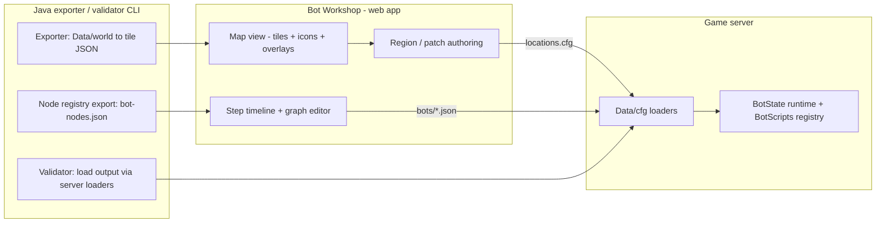

# BOT_TOOLING.md — the bot-maker tool (visual authoring)

Status: **planning doc.** Sibling track to `BOT_ROADMAP.md` and `BOT_PLAN.md`.
Neither of those changes: this describes a *separate program* that authors the data
they define.

Decisions recorded here:

- The bot-maker lives in its own file (this one), as a sibling track.
- **Stack: a web app plus a small Java exporter/validator CLI.**
- **Scope: bots only for now.** A general content editor (objects, spawns, doors,
  shops) is explicitly a later extension — see §12.

---

## 1. The idea, stated precisely

A companion program — call it the **Bot Workshop** — that lets you:

1. See a copy of the world map (top-down tiles, one plane at a time) **with resource and
   service icons** — trees, rocks, fishing spots, banks — classified automatically from
   the object definitions.
2. Draw named regions / "patches" and drop resource points directly on the map.
3. Compose a bot's behaviour as a **step timeline** (`walk here` → `chop` → `walk` →
   `bank` → `repeat`), with a node graph as the later advanced view.
4. Export that as data the server loads — with no server code change.

## 2. Why this is feasible here (not a from-scratch map editor)

Two things already in the tree make this realistic.

**The server ships its own offline map dataset.** `Region.load()` decodes ground and
object maps straight off disk — no client cache needed:

```437:469:Proxy Server/src/server/clip/region/Region.java
			File f = new File("./Data/world/map_index");
			byte[] buffer = new byte[(int) f.length()];
			DataInputStream dis = new DataInputStream(new FileInputStream(f));
			dis.readFully(buffer);
			dis.close();
			ByteStream in = new ByteStream(buffer);
			int size = in.length() / 6;
			regions = new Region[size];
			...
				byte[] file1 = getBuffer(new File("./Data/world/map/" + mapObjectsFileIds[i] + ".gz"));
				byte[] file2 = getBuffer(new File("./Data/world/map/" + mapGroundFileIds[i] + ".gz"));
```

Plus `Data/objectSize.cfg` (8,520 footprints) and `loc.dat` / `loc377.dat` for object
definitions. So the tool renders from data the server already owns, and the tool and the
server cannot disagree about the world.

**"Patches on the map" already exists as a server concept.** `Patch` is a named
rectangular region with metadata:

```5:11:Proxy Server/src/server/game/players/Patch.java
	public int minX = -1, maxX = -1, minY = -1, maxY = -1, produce = -1, produceAmount = -1, pickXP = -1;
	public int[] produceSpot = new int[2];
	
	public Patch(int minX, int maxX, int minY, int maxY, int[] produceSpot, int produce, int produceAmount, int pickXP) {
```

And map content is already authored as plain text the tool can emit into
(`Data/cfg/global-objects.cfg`, `spawn-config.cfg`, `teleports.cfg`, `doors.cfg`, …).
`global-objects.cfg` currently holds only its header and `[ENDOFOBJECTLIST]`:

```
// objectId	X	Y	H	Face	objectType
[ENDOFOBJECTLIST]
```

So the "patches" the workshop draws should be the *same* concept as `Patch`/`Locations`:
a named region with a kind and metadata. One concept, drawn here, consumed by the
runtime and by `Locations`.

**Resources can be enumerated and classified from data the server already has.**
`ObjectDef` carries a name and an actions array:

```571:598:Proxy Server/src/server/clip/region/ObjectDef.java
	public String name;
	...
	public String actions[];
```

The action strings are canonical (`"Bank"`, `"Chop down"`, `"Mine"`, `"Net"`, `"Cook"`,
…), so "show every tree in the world" is a scan of the object maps filtered by a rules
table — **no manual tagging**. The client also ships a sprite system (`ui/Sprite.java`,
`ui/RSInterface.java`), so real interface icons are extractable later if the curated set
is not enough.

---

## 3. Governing principle

> **The tool emits data. The server never changes to accept a new bot.**

This mirrors `BOT_ROADMAP.md` §2 (additive extension). If adding a bot requires touching
`BotManager` or `BotPlayer`, the tool has failed. Consequences:

- The server runs fine with the tool absent.
- The tool is a sibling track, not a component of the server.
- Its entire contract is "files the server already understands."

---

## 4. Architecture



Three layers, built bottom-up.

**The user experience of these layers** — layout, map interactions, the icon layer, and
the step timeline in detail — is specified in `BOT_WORKSHOP_UX.md`.

### Layer 1 — Map view (read-only)

Top-down tiles from `Data/world/map/*.gz` + `loc.dat`, one plane at a time. Toggleable
overlays: clipping (`Region.getClipping`), NPC spawns, global objects, teleports, named
regions, and the resource/service icon layer below. Click a tile → coordinates, objects
present, walkable or not. Useful on its own as a debug view.

The map is **continuous rather than one region at a time**: `workshopExport` writes
`world.json` describing every region in `map_index`, so the viewer can draw the world at a
glance (density-shaded blocks, one dot per bank) and lazily fetch the regions a pan or zoom
reaches, up to a bounded cache. A region the export did not write is drawn as a gap — a fact
about the export, not a claim that the world is empty there.

### Layer 1b — Resource & service icon layer

This is the layer that makes the map *usable* rather than merely accurate. Every static
object whose def matches a rule is drawn with a small icon and a hover label:

| Def action contains | Icon | Class |
| --- | --- | --- |
| `Bank` | 🏦 | service |
| `Chop down` | 🌳 | resource |
| `Mine` | ⛏ | resource |
| `Net` / `Bait` / `Lure` / `Cage` / `Harpoon` | 🐟 | resource |
| `Cook` | 🔥 | service |
| `Smith` | 🔨 | service |
| `Pray` / `Recharge` | ✝ | service |

Rules are a table (def action → icon), so a new category is a table row, not code.
Icons start as a **curated category set** (decision: curated-first); real interface
sprites can be swapped in later by extracting from the client's sprite archive, and true
model thumbnails are a further, larger option that is deliberately deferred.

The same enumeration powers a **resource filter panel**: pick `tree.oak` and the map
isolates every oak — exactly what an author wants when placing a bot.

### Layer 2 — Region / patch authoring (write data)

A rectangle tool producing the `Patch`/region shape (id, name, bounds, plane, kind,
metadata) plus a point tool for resource spots. Output is the `Locations` table from
`BOT_ROADMAP.md` Phase C:

```
# Data/cfg/locations.cfg
region = draynor_bank   x 3092 y 3243  w 6 h 5  plane 0  kind bank
region = lumbridge_cows x 3253 y 3267  w 8 h 8  plane 0  kind combat
point  = oak_3192_3223  x 3192 y 3223  plane 0  resource tree.oak  id 1276
```

The editor should also **render existing farming `Patch` bounds** so they are visible
rather than buried in `Farming.java`.

### Layer 3 — Step timeline (the primary authoring surface)

The main editor is a **timeline**, not a graph (decision). The author works directly on
the map and builds a list of steps, which is exactly how a bot is described in words:

```
Bot: willow_draynor
  ▸ Waypoint  region: Draynor willows        jitter 3   [randomize ✓]
  ▸ Action    Chop willows                   until inventory full
  ▸ Waypoint  region: Draynor bank           jitter 2   [randomize ✓]
  ▸ Action    Bank                           deposit: willow logs
  ▸ Repeat ↺
```

- **Waypoint steps** are drawn by dragging a **box** on the map, not clicking a tile —
  producing the region + jitter waypoint from `BOT_ROADMAP.md` §5.2 (`RandomTileIn`).
  This is the "rough idea within certain tiles, not the exact same tile" requirement.
- **Action steps** come from right-clicking a map object. The object's def already lists
  its actions, so the menu is *generated* (`Chop down`, `Bank`, `Mine`, …); choosing one
  opens its typed parameters (until-full, item, count).
- **"Create bot here"** drops the bot's home region — the first waypoint — which is what
  "the bot recognises where it is" means concretely.

The timeline serialises to the ordinary `Sequence`/`Repeat` tree, so it is not a lesser
format — it is the common case of the same data.

### Layer 3b — Behavior graph editor (advanced view)

The same document, opened as a node graph for authors who need `Selector`, `Parallel`,
retries or branching. Composite nodes own children, leaf/condition nodes have typed
parameters, decorators wrap one child. It serialises to exactly the same `BotScript`
structure the runtime executes (roadmap Phase D):

```json
{
  "name": "gather_oak",
  "root": {
    "type": "repeat", "count": -1,
    "child": {
      "type": "sequence",
      "children": [
        { "type": "walkToNearest", "resource": "tree.oak", "range": 3 },
        { "type": "gather", "resource": "tree.oak", "item": "logs", "until": "inventoryFull" },
        { "type": "walkToNearest", "region": "bank.draynor" },
        { "type": "bankAll", "item": "logs" }
      ]
    }
  }
}
```

Timeline and graph are two views of one document; switching never loses data. The
timeline is built first (decision); the graph lands once `Selector`/`Parallel` exist in
the runtime (roadmap Phase B, which is now implemented).

---

## 5. The node registry — where "object-oriented" comes from

The editor's palette is **generated**, not hand-maintained. Each node type is one Java
class annotated once:

```java
@BotNode(id = "walkToNearest", category = Category.ACTION,
         params = { @Param(name = "resource", type = Target.class),
                    @Param(name = "range", type = int.class, def = "1") })
public final class WalkToNearest implements BotState { ... }
```

The exporter walks the registry and emits `bot-nodes.json`; the editor builds its palette
and parameter forms from that file. Adding a `BotState` + annotation and re-running the
exporter makes it appear in the editor — **zero editor code changes**.

**Anti-drift guard:** a parity test asserts every runtime node id has a palette entry and
vice versa, in the spirit of `WoodcuttingObjectsTest`. That is what stops the schema and
the runtime diverging.

**The one exception, declared not filtered.** Roadmap Phase F added `Traced`, a tracing wrapper the
runtime applies itself. It is a `BotState`, so an absolute parity test would demand a palette entry for
something no author can place and an editor must never offer. Rather than loosen the check — which is how
a genuinely unannotated node slips through — the exception is declared on the class with its reason:

```java
@RuntimeOnly("applied by the builder and the runtime for tracing; never placed in the editor")
public final class Traced implements BotState { ... }
```

`NodeCoverage` reads that marker, so the guard stays absolute and the exception stays reviewable. Both
directions are pinned: anything not marked must be annotated **and** registered, and anything marked must
**not** be registered — so the marker cannot be used to hide a real node from the palette. The exporter
also prints the marked classes, so a deliberate exception is visible in the build output rather than
implied.

**Escape hatch:** a `script` node holding a small expression/DSL for one-offs, so the
graph never has to cover 100% of cases.

---

## 6. Tool ↔ server boundary

**Offline first (the deliverable).** The tool reads `Data/world` + `Data/cfg` and writes
`Data/cfg/*`. Text, stable-ordered, git-diffable, reviewable. The server loads at startup
or on a `::bot reload` command. No runtime coupling.

**Live later (optional, Stage T7).** A small read-mostly control channel:
**possess/release** (a bot is a real character — `BOT_PLAN.md` §5.4), pause/step, and read
the per-bot trace ring buffer from `BOT_ROADMAP.md` Phase F to draw a *running* bot's
path and current state node on the map. A possessed bot is just a player in the world,
so the tool can show which account is currently script-driven and which is idle — the
same account a human could log into and play. This is the strongest debugging feature,
but it is an add-on, not a foundation.

---

## 7. Data formats owned by the tool

| File | Purpose | Consumed by |
| --- | --- | --- |
| `Data/cfg/locations.cfg` | Named regions + resource points | `Locations` (roadmap C) |
| `Data/cfg/bots/*.json` | One behaviour graph per script | `BotScripts` registry (roadmap D) |
| `Data/cfg/bots.cfg` | Account lines (account, password, script, home, enabled) | `BotManager` (roadmap E) |
| `bot-nodes.json` | Palette/schema export | The editor only (generated) |

All of these are additive: the server ignores files it does not know about.

### 7.1 The script document, concretely

`Data/cfg/bots/<name>.json` is one behaviour graph. The file name is the script's name — the
handle `bots.cfg`'s `script` field points at — and a `name` field, if present, must match it.

```json
{
  "root": {
    "node": "sequence",
    "children": [
      { "node": "walk_to_nearest", "kind": "tree", "range": 3 },
      { "node": "gather", "kind": "tree", "itemId": 1519 },
      { "node": "walk_to_nearest", "kind": "bank", "range": 2 },
      { "node": "bank_logs", "logItemId": 1519 }
    ]
  }
}
```

One object per node: `node` names the `@BotNode` id, and every other key is one of that node's
constructor parameters, *by name*. Defaults are the ones in `@Param`, so an optional parameter
can be omitted; a required one that is missing is an error. Children are nested objects (`node`)
or arrays of them (`node_list`). Scalars are JSON scalars, and a `kind` is a kind id such as
`tree` or `bank`.

**The schema is the source of truth, and the loader reads it.** `server.game.bots.script.ScriptDocument`
builds each node through `BotNodeRegistry`, so the ids, parameters, types and defaults all come from
the annotated classes rather than a second copy in this format. A new `BotState` becomes authorable
the moment it is annotated — there is nothing to add here. This is the loader half of the parity
check §5 describes; `ScriptDocumentTest` fails if a node gains a parameter type the loader cannot
encode.

Two deliberate strictnesses, both because a wrong script is worse than a rejected one:

- **An unknown field is an error, not a fallback.** A misspelled parameter would otherwise quietly
  take its default and the bot would run with a silently wrong value.
- **`LOCATION` parameters are refused.** No node declares one yet, so there is no encoding to agree
  with the editor; inventing one here would be a second format to drift from this table. The day a
  node takes a `Location`, its encoding gets written deliberately.

**Loading.** The server reads the whole directory at boot and on `::bot reload`. A reload reflects
the directory: a script whose file was edited is replaced, one whose file was deleted disappears, and
a built-in is never dropped. A bad file costs only itself — it is reported and skipped, exactly as a
bad `bots.cfg` row is — and a missing directory is not even a problem.

### 7.2 The editor writes that document, it does not invent one

The timeline (`BOT_WORKSHOP_UX.md` §5, `workshop/web/js/timeline.js`) is a view of §7.1's document,
not a lesser format — so it compiles to exactly the shape the loader already reads, and it holds no
node id, parameter name or parameter type of its own. Everything comes from `bot-nodes.json` (`§5`),
which is the reflection of the annotated classes: the palette, the parameter fields, and the dropdown
of `kind` values.

Three rules make the mapping lossless in both directions:

- **The palette is every node with no child parameter.** A `NODE`/`NODE_LIST` parameter means the node
  is structure (`sequence`, `repeat`, the decorators around a step) rather than a step, so the timeline
  does not offer it. This is one rule about the schema, not a list of node names.
- **Compile is one wrap.** The steps become a `sequence`; if the author ticked repeat it is wrapped in
  a `repeat`. The parameter names `child`, `children` and `count` are read from the palette, so even the
  wrapper is schema-driven.
- **A parameter the author never touched is omitted**, so the node's own default applies and a later
  change to that default is picked up. A value stated explicitly is written, because the document is the
  author's intent.

**The tool writes the file; the browser does not.** `POST /scripts/check` and `POST /scripts/save` take
the document as JSON, run it through `ScriptDocument` — the server's own loader — and then re-emit it
(`botworkshop.export.ScriptDocs`) before writing `Data/cfg/bots/<name>.json`. Re-emission is canonical:
`node` first, then each parameter in the node's declared order, integers as integers. Two authors who
build the same graph get the same bytes, and re-saving an unchanged graph is a byte-identical file —
which is what makes the output git-diffable (§6). The save refuses a name that is not a file name and a
name that would shadow a built-in, and it validates before it touches the disk, so a rejected document
leaves the previous file exactly as it was. `gradlew workshopValidateScripts` re-loads the directory
through the same loader, so a bad script fails in a command rather than as a skipped line at boot.

**Round-trip.** Reopening a saved script reconstructs its steps. A document this editor did not write —
one with a nested composite or a decorator around a step — opens read-only with the reason shown, rather
than being flattened into a list that would drop the parts a timeline cannot hold.

---

## 8. Stack decision

**Web app + Java exporter/validator CLI.** The CLI lives in the existing `tools/` idiom
(`Proxy Client/tools/*` is the precedent).

The CLI has three jobs, and it is deliberately the *single* place that decodes
`Data/world`:

- **Exporter:** `Data/world` → tile/JSON for the editor.
- **Node export:** `@BotNode` registry → `bot-nodes.json`.
- **Validator:** load the editor's output through the **server's own loaders** before you
  commit, so bad data fails at authoring time, not at server start.

Rejected alternatives, for the record: a Java desktop app (Swing/JavaFX) could reuse the
server decoders in-process with no export step, but the graph/map UI is far more work; and
extending the GL client gives a live world view for free but couples the tool to client
internals.

---

## 9. Coordinate and plane gotchas the editor must handle

- **Planes:** `heightLevel` 0–3; show one at a time.
- **Regions vs absolute coords:** regions are 64×64, indexed 8×8, but the server's unit
  is absolute `absX`/`absY` — display absolute.
- **Offset / instanced maps:** dungeons use coordinate offsets (e.g. y+6400) or dedicated
  regions; the editor needs a region list, not one continuous map. The viewer has both: the
  navigator lists the exported regions, and the map itself is continuous (`world.json`
  covers all 1226, so a region that is not there is drawn as a gap rather than closed up).
- **Static vs dynamic:** `Data/world` holds static spawns; fallen trees etc. are runtime.
  Mark statics.
- **Revalidation:** if map data changes, a region may point at a tile that no longer holds
  its object; the validator should flag stale targets.

---

## 10. Phased plan (sibling to roadmap A–I)

| Stage | Deliverable |
| --- | --- |
| **T1** ✅ | Java exporter/validator library: read `Data/world` + `Data/cfg`, emit map JSON/tiles |
| **T2** ✅ | Web map viewer: pan/zoom, planes, overlays, tile inspector (`BOT_WORKSHOP_UX.md` §2) |
| **T2b** ✅ | Resource/service icon layer (`ObjectDef.actions` classification) + resource filter panel (`BOT_WORKSHOP_UX.md` §3–§4) |
| **T3** ✅ | Region/patch authoring → `locations.cfg`; drag-a-box → `RandomTileIn` waypoints |
| **T4** ✅ | `@BotNode` registry + `bot-nodes.json` export + parity test |
| **T4b** ✅ | Server-side document loader: `Data/cfg/bots/*.json` → `BotScript`, via the T4 schema (§7.1). The half a timeline editor needs to compile *to* |
| **T5** ✅ | Step timeline editor → `BotScript` JSON (`BOT_WORKSHOP_UX.md` §5). Palette and parameter forms generated from `bot-nodes.json` (§7.2); the server validates the document with its own loader and writes the canonical bytes; reopening reconstructs the timeline |
| **T5b** | Graph view over the same document (roadmap B is done, so the nodes exist) |
| **T6** | Round-trip validation: compile a timeline, load it via the runtime, run the slice-1 loop test. Partly met: `workshopValidateScripts` re-loads the authored directory through `ScriptDocument`, and `Data/cfg/bots/chop_and_bank.json` — authored in the editor — assembles as `Repeat(forever)`; the timed in-world run is what remains |
| **T7** *(optional)* | Live channel: spawn/step + running-bot trace overlay |
| (Later) | Generalise to other content (see §12) |

**Sequencing is a hard dependency.** T4–T6 consume `Locations` (roadmap C) and
`BotScript` (roadmap D). Build the data models first (roadmap A → B → C → D), then the
tool authors *those*. An editor built before its schema exists is editing a moving target.

Suggested interleave: roadmap A (slice 1) → B, C, D → tool T1–T3 in parallel with E/F →
T4–T6 → T7.

---

## 11. Risks and cautions

- **Never a hard dependency.** The server must run standalone; the tool only produces
  files it already understands.
- **Schema discipline is the whole game.** One schema shared by exporter, runtime and
  editor, with a parity test. Drift is the failure mode.
- **Scope creep is the other failure mode.** Bots only until the map view and one full
  authoring round-trip work end to end.
- **Effort is real.** Layer 1 is days; Layers 2–3 plus the graph editor is weeks. Worth
  it only if many bots will be authored — which is the premise.
- **Do not edit server data in place.** Emit, validate, diff; commit by hand.

---

## 12. Later: generalize to a content editor (explicitly out of scope now)

Once the map view and the region/point tools work, the same machinery covers other
`Data/cfg` content with almost no new concepts: global objects
(`global-objects.cfg`), NPC spawns (`spawn-config.cfg`), teleports (`teleports.cfg`),
doors (`doors.cfg`), shops. That is a natural extension, but it is **deferred**: the
first target is bots, and a bot-only tool that ships beats a general editor that doesn't.

---

## 13. Acceptance criteria

- **T2:** the map view renders a known region (e.g. Lumbridge) with tiles, objects and
  clipping matching the running server.
- **T2b:** in that region, trees/rocks/fishing spots/banks are iconised automatically
  from `ObjectDef.actions`, and the resource filter isolates one resource type.
- **T3:** a region drawn in the editor appears in `locations.cfg`, loads without error,
  and `Locations` resolves "nearest oak" from it; a dragged box yields a `RandomTileIn`
  waypoint that puts two bots on different tiles. The editor reports how many objects of
  the drawn kind the box holds before it writes, from the regions it has loaded, and says
  when a box is empty — the same failure `ValidateMap` reports as `EMPTY`, caught earlier.
  That count is a warning, not the check: `ValidateMap` scans the whole world server-side.
- **T4:** every runtime `BotState` id appears in `bot-nodes.json`; the parity test fails
  if either side gains an unregistered entry. ✅ A state the runtime applies itself is
  marked `@RuntimeOnly` and excluded in both directions, so the check stays absolute.
- **T4b:** a script document in `Data/cfg/bots/*.json` builds a `BotScript` the runtime runs, using
  only the T4 schema — a document naming an unknown node, an unknown field or a missing required
  field is refused with the node and field named, and every registered node builds from the fields its
  schema declares. ✅ The directory loads at boot and on `::bot reload`, a reload reflects the
  directory, and a bad file costs only itself.
- **T5:** a timeline built in the editor serialises to a `BotScript` the runtime executes. ✅ The palette
  and every parameter form come from `bot-nodes.json` (§7.2), so no node is hardcoded; Save sends the
  document to the server, which accepts it through `ScriptDocument` and writes the canonical file, and a
  document the loader refuses is reported on the step and writes nothing. Opening a saved script
  reconstructs its steps; a graph the linear timeline cannot hold opens read-only rather than losing it.
- **T6:** the exported timeline runs the slice-1 chop→bank loop end to end with no
  hand-written bot code. ◐ `Data/cfg/bots/chop_and_bank.json` was authored in the editor and
  `workshopValidateScripts` loads it through the server's loader as `Repeat(forever)`; the
  in-world timed run (§4's slice-1 loop) is the remaining half.
- **Throughout:** deleting the tool and its outputs leaves the server fully functional.
